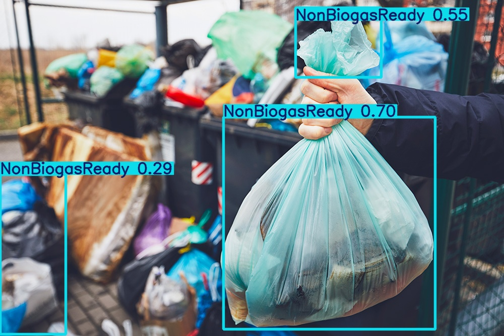
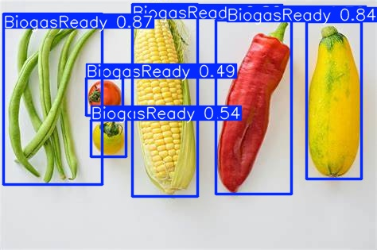
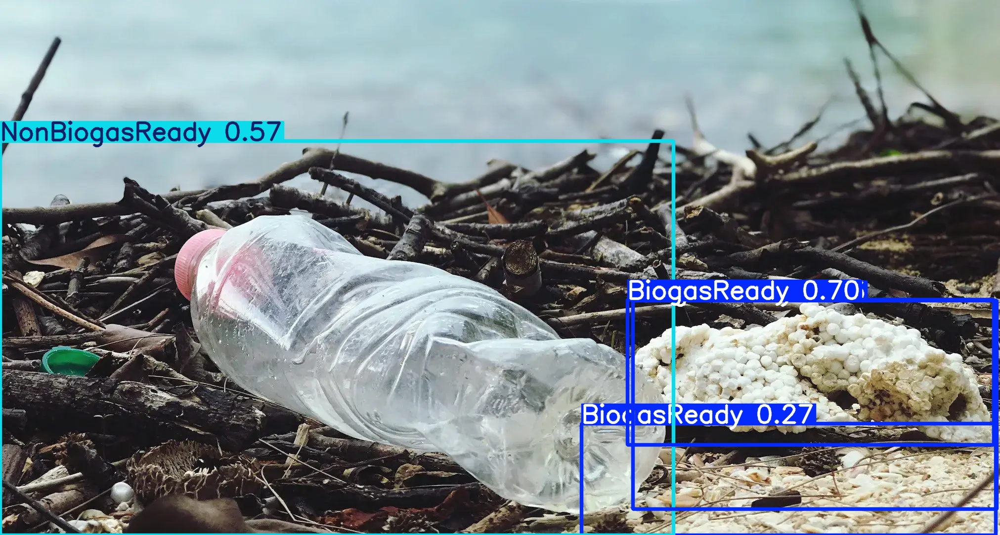

## Biodegradable and Non-Biodegradable Materials

## 🌍 Introduction

This repository aims to highlight the differences between biodegradable and non-biodegradable materials, their environmental impacts, and how we can contribute to waste management effectively. With the use of object detection models, we demonstrate the identification of these materials using images.

## 🌿 What are Biodegradable Materials?

Biodegradable materials are substances that decompose naturally through microorganisms, resulting in minimal environmental impact. These materials break down into water, carbon dioxide, and biomass.

Examples:

Organic waste (fruits, vegetables)

Paper and cardboard

Natural fibers (cotton, wool)

## Key Features:

Decomposes quickly

Enriches the soil

Environmentally friendly

## Sample Detection:

🔷 What are Non-Biodegradable Materials?

Non-biodegradable materials are substances that do not decompose or take a very long time to break down. These materials accumulate in the environment, often leading to pollution and harm to ecosystems.

Examples:

Plastics (bottles, bags)

Metals (cans)

Glass (jars, containers)

Key Features:

Long decomposition time

Requires recycling or specialized disposal methods

Harmful to the environment if improperly managed

## Sample Detection:

## 🔢 Object Detection for Waste Classification

Using advanced object detection models, materials can be classified into biodegradable and non-biodegradable categories with confidence scores. This enables:

Workflow:

Input: Image containing waste materials.

Processing: Apply object detection model.

Output: Annotated image with confidence scores for biodegradable or non-biodegradable materials.

Benefits:

## Automated waste sorting.

Real-time monitoring of waste in various environments.

Increased efficiency in recycling and composting efforts.

## 🚜 How to Help

Reduce: Limit the use of single-use plastics and non-biodegradable items.

Recycle: Properly segregate waste for recycling.

Compost: Set up a composting system for biodegradable waste.

Spread Awareness: Educate others about sustainable waste practices.

## 📈 Results from Object Detection

Below are sample outputs from the object detection model:

## Description of Results:

Image 1: Detection of Biogas Ready and Non-Biogas Ready materials with confidence scores.

Image 2: High confidence detection of biodegradable vegetables.

## Output Format:

Bounding Boxes: Highlight detected objects.

Labels: Class name (e.g., "Biogas Ready" or "Non-Biogas Ready").

Confidence Scores: Indicate the likelihood of the classification.

## 🌍 Conclusion

This project combines environmental awareness with technology to address waste management challenges. Through automated detection and classification, we can better manage biodegradable and non-biodegradable waste, contributing to a sustainable future.

 
